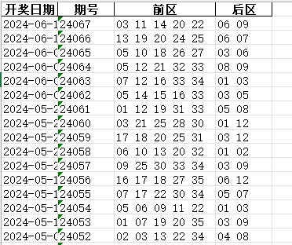
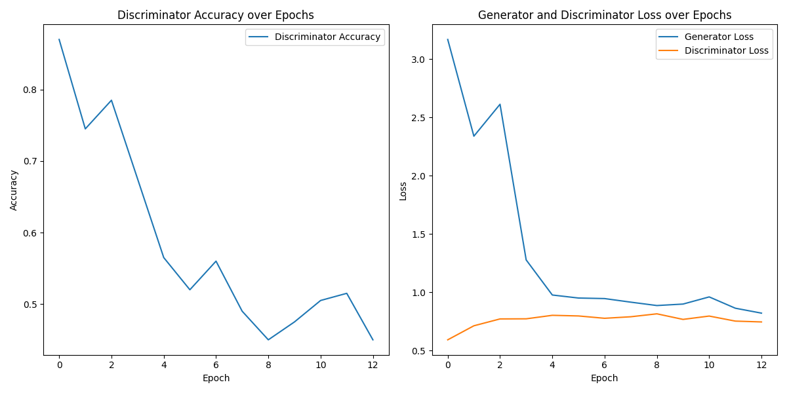
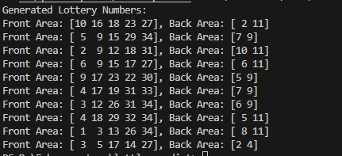
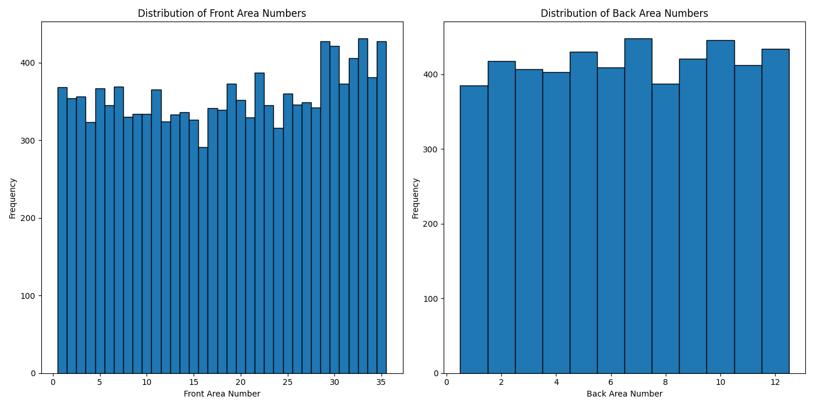
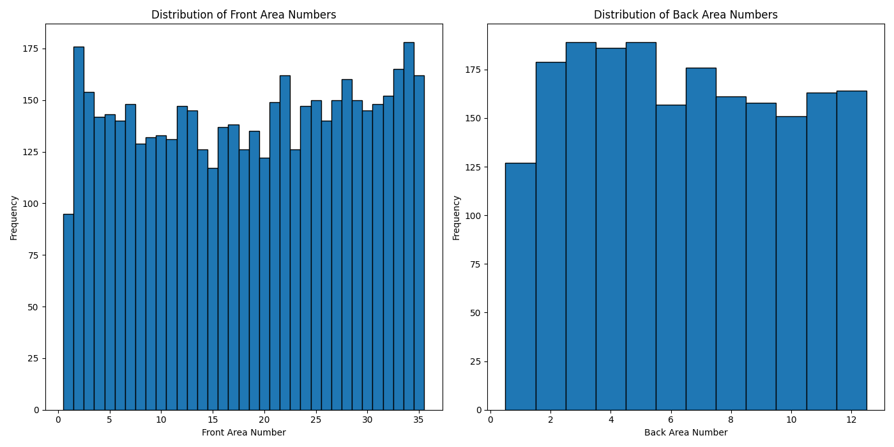

# 基于生成对抗网络的彩票号码生成

## 1.教程
[用GAN网络生成彩票号码](https://ephemeroptera.blog.csdn.net/article/details/139585310 "")

```shell
> python train.py
> python test.py
> python export_onnx.py
> python infer_onnx.py
```


## 2. 展示

> a.数据集



---

> b.训练过程



---

> c.彩票预测



---

> d.真实号码分布



---

> e.生成号码分布



---

## 3. 联系作者
> 版本：V3.2

> CSDN主页：[Pika在线](https://ephemeroptera.blog.csdn.net "")

> 邮箱：605686962@qq.com